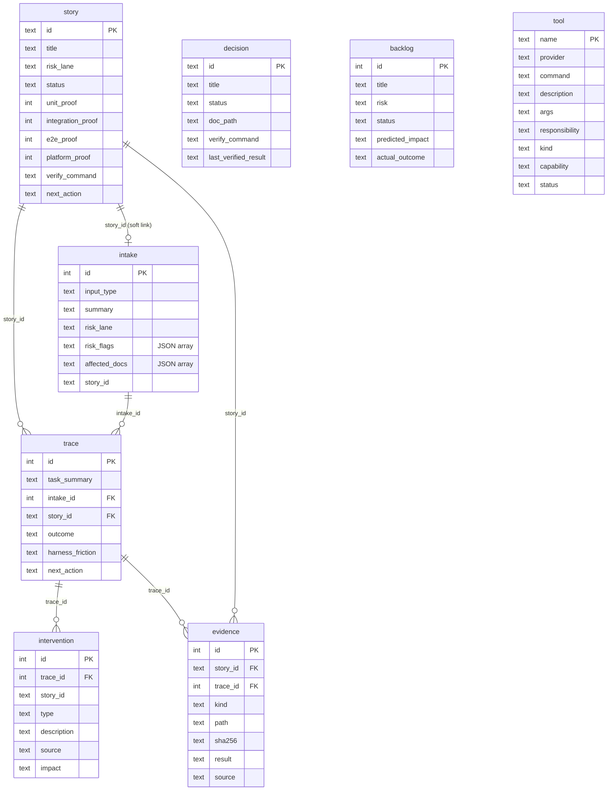

# Data model

## Summary

The harness keeps **policy in Markdown but operational data in SQLite**. The
durable layer is a local `harness.db` file whose shape is defined entirely by
ordered SQL migrations under [`_harness/schema/`](../../_harness/schema). The
[`harness-cli`](./harness-cli.md) crate creates the database, applies
migrations, and reads/writes these tables. There are no ORMs or hand-edited
database files — the schema is the source of truth.

## Key files

- [`_harness/schema/001-init.sql`](../../_harness/schema/001-init.sql) — base
  schema: `schema_version`, `intake`, `story`, `decision`, `backlog`, `trace`.
- [`_harness/schema/002-story-verify.sql`](../../_harness/schema/002-story-verify.sql)
  — adds `verify_command`, `last_verified_at`, `last_verified_result` to
  `story`.
- [`_harness/schema/003-tool-registry.sql`](../../_harness/schema/003-tool-registry.sql)
  — adds `tool`: the machine-readable registry of user-provided project tools.
- [`_harness/schema/004-intervention.sql`](../../_harness/schema/004-intervention.sql)
  — adds `intervention`: review / human / CI / agent interventions, separated
  from normal traces.
- [`_harness/schema/005-tool-extensions.sql`](../../_harness/schema/005-tool-extensions.sql)
  — extends `tool` with `kind`, `capability`, `scan_target`, `status`,
  `checked_at` (declared intent + last-scanned presence).
- [`_harness/schema/006-next-action.sql`](../../_harness/schema/006-next-action.sql)
  — adds `story.next_action` (live resume pointer) and `trace.next_action`
  (immutable record at trace time) for WIP continuity across sessions.
- [`_harness/schema/007-evidence.sql`](../../_harness/schema/007-evidence.sql) —
  adds `evidence`: a pointer table (path + SHA256 + digest) to gitignored local
  artifacts under `_harness/evidence/` (see
  [decision 0002](../../docs/decisions/0002-evidence-gitignore-pointer-store.md)).
- [`crates/harness-cli/src/domain.rs`](../../crates/harness-cli/src/domain.rs) —
  the record structs and enums (`InputType`, `RiskLane`) mirroring these tables.

## Internals

`trace.intake_id` references `intake(id)` and `trace.story_id` references
`story(id)`; `intake.story_id` is a soft link to a story created from that
intake, and `intervention.trace_id` / `intervention.story_id` link an
intervention to the work it corrected; `evidence.story_id` / `evidence.trace_id`
link a stored artifact to the work that produced it. `schema_version` records
which migrations have been applied (currently up to version 7) — the CLI reads
`MAX(version)` to decide what to migrate.

## Public interface

These tables are reached only through the [`harness-cli`](./harness-cli.md)
commands, not edited directly:

| Table          | Written by                                     | Read by (query view)        |
| -------------- | ---------------------------------------------- | --------------------------- |
| `intake`       | `intake`                                       | `query intakes`             |
| `story`        | `story add/update/verify`                      | `query matrix`              |
| `decision`     | `decision add/verify`                          | `query decisions`           |
| `backlog`      | `backlog add/close`                            | `query backlog`             |
| `tool`         | `tool register/remove`                         | `query tools`               |
| `intervention` | `intervention add`                             | `query interventions`       |
| `trace`        | `trace`                                        | `query traces` / `friction` |
| `evidence`     | `evidence add` / `story verify` (auto-capture) | `evidence list`             |

CHECK constraints encode the domain vocabulary — e.g. `risk_lane` ∈
`{tiny, normal, high_risk}`, story `status` ∈
`{planned, in_progress, implemented, changed, retired}`, trace `outcome` ∈
`{completed, blocked, partial, failed}`, intervention `type` ∈
`{correction, override, escalation, approval}` and `source` ∈
`{human, reviewer, ci, agent}`. List-valued columns store JSON arrays, produced
from CSV input by `CsvList` in
[`domain.rs`](../../crates/harness-cli/src/domain.rs#L1281-L1308).

## Dependencies

- **In:** none — this is the innermost data definition.
- **Out:** consumed by [harness-cli](./harness-cli.md), which applies these
  migrations and surfaces the [Agent Harness](./agent-harness.md) `query` views.

[← Home](./README.md)
