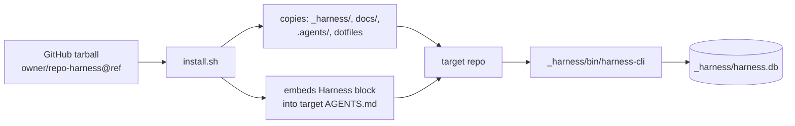

# Distribution

## Summary

This component is how the harness gets **into another repository**. Bash scripts
fetch the harness from GitHub and copy it into a target project; the prebuilt
CLI binary, the SQL schema, and operator docs all live under
[`_harness/`](../../_harness). An installed project uses the vendored harness
and the prebuilt `harness-cli` without needing a Rust toolchain. A separate
[`migrate.sh`](../../migrate.sh) upgrades older installs that scattered these
files (`scripts/`, a root `harness.db`) into the unified `_harness/` layout.

## Key files

- [`install.sh`](../../install.sh) — vendors the harness `INSTALL_ITEMS`
  (`.editorconfig`, `.prettierignore`, `.prettierrc`, `_harness/`, `docs/`,
  `.agents/`) into a target directory from a release tarball, and _embeds_ a
  Harness block into the target's `AGENTS.md` rather than overwriting it.
- [`migrate.sh`](../../migrate.sh) — upgrades an old-layout install to the
  unified `_harness/` layout (moves `harness.db`, reinstalls the engine,
  preserves repo-owned content, fixes live DB paths). Requires a clean git tree.
- [`install-harness-cli.sh`](../../install-harness-cli.sh) — installs just the
  CLI binary.
- [`_harness/bin/harness-cli`](../../_harness/bin/harness-cli) — the prebuilt
  CLI used by installed repos (Windows: `harness-cli.exe`).
- [`_harness/schema/`](../../_harness/schema) — SQL migrations applied by the
  CLI (see [Data model](./data-model.md)).
- [`_harness/docs/scripts-README.md`](../../_harness/docs/scripts-README.md) —
  CLI usage cheatsheet.

## Internals

`install.sh` resolves owner/repo/ref from `HARNESS_LITE_*` environment
variables, downloads a codeload tarball into a temp dir, and copies the fixed
`INSTALL_ITEMS` list into `TARGET_DIR` (default: the current directory) — while
preserving the target repo's own workspace (`docs/decisions`, `docs/stories`,
`docs/product`, `docs/wiki`, `KNOWLEDGE_INDEX.md`). It fails fast if `curl` or
`tar` is missing.

## Public interface

- **Install everything:** run [`install.sh`](../../install.sh) from the target
  repo root (override `HARNESS_LITE_OWNER` / `HARNESS_LITE_REPO` /
  `HARNESS_LITE_REF` / `HARNESS_LITE_TARGET_DIR` as needed).
- **Install just the CLI:** run
  [`install-harness-cli.sh`](../../install-harness-cli.sh).
- **Run the durable layer:** `_harness/bin/harness-cli <command>` — see
  [`_harness/docs/scripts-README.md`](../../_harness/docs/scripts-README.md) and
  [`_harness/03-CLI_REFERENCE.md`](../../_harness/03-CLI_REFERENCE.md).

## Dependencies

- **In:** packages the [Agent Harness](./agent-harness.md),
  [Documentation](./documentation.md), and the [harness-cli](./harness-cli.md)
  binary + [Data model](./data-model.md) schema.
- **Out:** requires only `curl`, `tar`, and a POSIX shell on the target host.

[← Home](./README.md)
