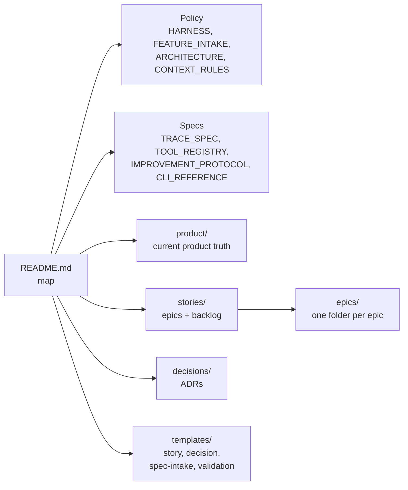

# Documentation

## Summary

The [`docs/`](../../docs) tree is the **human-facing reference layer** —
policies, rationale, taxonomy, glossary, decisions, stories, and templates. It
is the deep counterpart to the agent-facing [Agent Harness](./agent-harness.md):
where `_harness/` tells an agent _what to do_, `docs/` explains _why_ and stores
the durable narrative artifacts. It begins at
[`_harness/docs/README.md`](../../_harness/docs/README.md).

> Note: `docs/wiki/` (this DeepWiki) is generated and lives alongside the
> reference docs but is not part of the harness contract.

## Key files

- [`_harness/docs/HARNESS.md`](../../_harness/docs/HARNESS.md) — how humans and
  agents collaborate.
- [`_harness/docs/FEATURE_INTAKE.md`](../../_harness/docs/FEATURE_INTAKE.md) —
  how prompts become tiny / normal / high-risk work.
- [`_harness/docs/ARCHITECTURE.md`](../../_harness/docs/ARCHITECTURE.md) —
  architecture discovery and boundary rules.
- [`_harness/docs/GLOSSARY.md`](../../_harness/docs/GLOSSARY.md) — shared
  vocabulary.
- [`_harness/docs/CONTEXT_RULES.md`](../../_harness/docs/CONTEXT_RULES.md) —
  what to read, when, and when to stop.
- [`docs/KNOWLEDGE_INDEX.md`](../../docs/KNOWLEDGE_INDEX.md) — the onboarding
  router (generated/maintained by the knowledge skill).
- [`_harness/docs/CLI_REFERENCE.md`](../../_harness/docs/CLI_REFERENCE.md) — the
  full `harness-cli` reference (the cheatsheet lives in
  `_harness/03-CLI_REFERENCE.md`).
- [`_harness/docs/TRACE_SPEC.md`](../../_harness/docs/TRACE_SPEC.md) /
  [`TOOL_REGISTRY.md`](../../_harness/docs/TOOL_REGISTRY.md) /
  [`IMPROVEMENT_PROTOCOL.md`](../../_harness/docs/IMPROVEMENT_PROTOCOL.md) —
  specs for traces, the tool registry, and the audit/propose improvement loop.
- [`_harness/docs/HARNESS_COMPONENTS.md`](../../_harness/docs/HARNESS_COMPONENTS.md)
  / [`HARNESS_MATURITY.md`](../../_harness/docs/HARNESS_MATURITY.md) —
  responsibility taxonomy and maturity tracking.

## Internals

The subtree splits into **policy** (the reference essays), **specs** (trace,
tool-registry, and improvement-protocol contracts), **durable narrative**
(`product/`, `stories/`, `decisions/`), and **templates** that seed new
artifacts. The narrative directories currently hold only their README
conventions — decisions are numbered ADRs and stories are organized under epics,
created as work happens.

## Public interface

- The [Agent Harness](./agent-harness.md) hierarchy points here:
  `docs/product/*` and `docs/stories/*` are authoritative product truth,
  `docs/decisions/*` are inherited tradeoffs.
- [`_harness/docs/templates/`](../../_harness/docs/templates) provides the
  canonical shapes for stories, decisions, spec intake, and validation reports —
  including the `high-risk-story/` packet (overview, execplan, design,
  validation).
- `docs/KNOWLEDGE_INDEX.md` is the read-first orientation map for every lane.

## Dependencies

- **In:** authored and updated by agents following the
  [Agent Harness](./agent-harness.md); the [Skills](./skills.md) generators
  write `docs/KNOWLEDGE_INDEX.md`.
- **Out:** referenced by `_harness/` as the deep-reference layer; legacy proof
  state (`TEST_MATRIX.md`, `HARNESS_BACKLOG.md`) is superseded by the
  [Data model](./data-model.md).

[← Home](./README.md)
